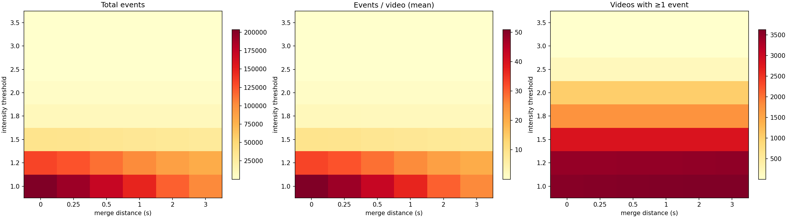
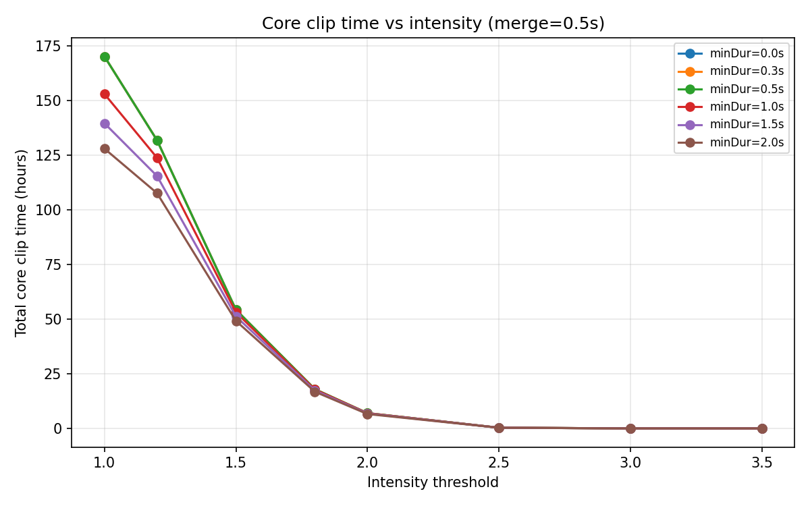
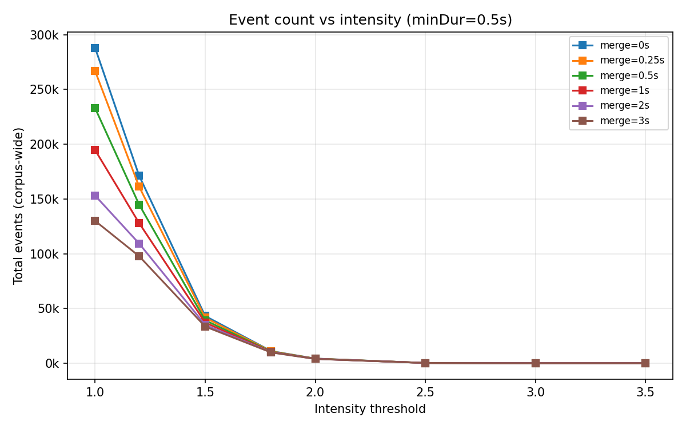
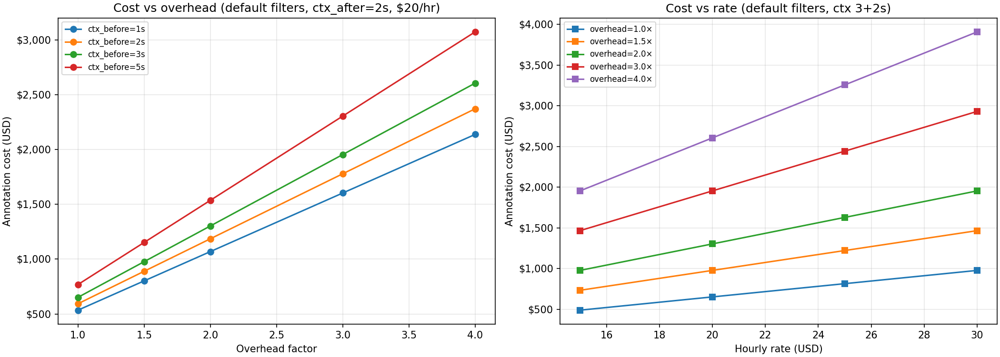
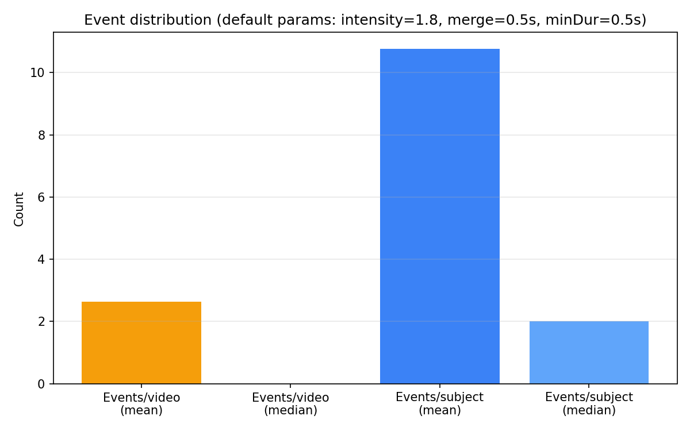

# Smiling Segments Parameter Sweep

**Corpus:** 3997 videos, 978 subjects  
**Core param combos:** 288  
**Full projection rows:** 92,160

## Parameter Grids

| Parameter | Values |
|-----------|--------|
| intensityThreshold | [1.0, 1.2, 1.5, 1.8, 2.0, 2.5, 3.0, 3.5] |
| mergeDistance (s) | [0.0, 0.25, 0.5, 1.0, 2.0, 3.0] |
| minDuration (s) | [0.0, 0.3, 0.5, 1.0, 1.5, 2.0] |
| contextBefore (s) | [1.0, 2.0, 3.0, 5.0] |
| contextAfter (s) | [1.0, 2.0, 3.0, 5.0] |
| overhead factor | [1.0, 1.5, 2.0, 3.0, 4.0] |
| hourly rate (USD) | [15.0, 20.0, 25.0, 30.0] |

## Core Sweep Summary (selected combos)

| intensity | merge | minDur | events | events/vid | events/subj | core hrs | vids w/ events |
|-----------|-------|--------|--------|------------|-------------|----------|----------------|
| 1.0 | 0.0 | 0.0 | 287,990 | 72.1 | 294 | 165.6 | 3779 |
| 1.0 | 0.0 | 0.5 | 287,985 | 72.1 | 294 | 165.6 | 3779 |
| 1.0 | 0.0 | 1.0 | 167,352 | 41.9 | 171 | 142.3 | 3582 |
| 1.0 | 0.5 | 0.0 | 232,963 | 58.3 | 238 | 170.1 | 3779 |
| 1.0 | 0.5 | 0.5 | 232,958 | 58.3 | 238 | 170.1 | 3779 |
| 1.0 | 0.5 | 1.0 | 143,938 | 36.0 | 147 | 153.0 | 3592 |
| 1.0 | 2.0 | 0.0 | 153,100 | 38.3 | 157 | 194.9 | 3779 |
| 1.0 | 2.0 | 0.5 | 153,098 | 38.3 | 157 | 194.9 | 3779 |
| 1.0 | 2.0 | 1.0 | 103,242 | 25.8 | 106 | 185.3 | 3604 |
| 1.2 | 0.0 | 0.0 | 171,221 | 42.8 | 175 | 129.6 | 3683 |
| 1.2 | 0.0 | 0.5 | 171,220 | 42.8 | 175 | 129.6 | 3683 |
| 1.2 | 0.0 | 1.0 | 121,054 | 30.3 | 124 | 119.7 | 3465 |
| 1.2 | 0.5 | 0.0 | 144,848 | 36.2 | 148 | 131.8 | 3683 |
| 1.2 | 0.5 | 0.5 | 144,847 | 36.2 | 148 | 131.8 | 3683 |
| 1.2 | 0.5 | 1.0 | 104,425 | 26.1 | 107 | 123.8 | 3473 |
| 1.2 | 2.0 | 0.0 | 109,307 | 27.3 | 112 | 142.9 | 3683 |
| 1.2 | 2.0 | 0.5 | 109,307 | 27.3 | 112 | 142.9 | 3683 |
| 1.2 | 2.0 | 1.0 | 81,462 | 20.4 | 83 | 137.4 | 3477 |
| 1.5 | 0.0 | 0.0 | 43,107 | 10.8 | 44 | 54.0 | 3016 |
| 1.5 | 0.0 | 0.5 | 43,106 | 10.8 | 44 | 54.0 | 3016 |
| 1.5 | 0.0 | 1.0 | 36,874 | 9.2 | 38 | 52.7 | 2807 |
| 1.5 | 0.5 | 0.0 | 39,195 | 9.8 | 40 | 54.3 | 3016 |
| 1.5 | 0.5 | 0.5 | 39,194 | 9.8 | 40 | 54.3 | 3016 |
| 1.5 | 0.5 | 1.0 | 33,600 | 8.4 | 34 | 53.1 | 2810 |
| 1.5 | 2.0 | 0.0 | 35,004 | 8.8 | 36 | 55.5 | 3016 |
| 1.5 | 2.0 | 0.5 | 35,004 | 8.8 | 36 | 55.5 | 3016 |
| 1.5 | 2.0 | 1.0 | 30,219 | 7.6 | 31 | 54.6 | 2811 |
| 1.8 | 0.0 | 0.0 | 11,042 | 2.8 | 11 | 17.9 | 1839 |
| 1.8 | 0.0 | 0.5 | 11,042 | 2.8 | 11 | 17.9 | 1839 |
| 1.8 | 0.0 | 1.0 | 10,203 | 2.6 | 10 | 17.7 | 1745 |
| 1.8 | 0.5 | 0.0 | 10,525 | 2.6 | 11 | 18.0 | 1839 |
| 1.8 | 0.5 | 0.5 | 10,525 | 2.6 | 11 | 18.0 | 1839 |
| 1.8 | 0.5 | 1.0 | 9,717 | 2.4 | 10 | 17.8 | 1745 |
| 1.8 | 2.0 | 0.0 | 9,990 | 2.5 | 10 | 18.1 | 1839 |
| 1.8 | 2.0 | 0.5 | 9,990 | 2.5 | 10 | 18.1 | 1839 |
| 1.8 | 2.0 | 1.0 | 9,242 | 2.3 | 9 | 18.0 | 1745 |
| 2.0 | 0.0 | 0.0 | 4,245 | 1.1 | 4 | 7.0 | 1080 |
| 2.0 | 0.0 | 0.5 | 4,245 | 1.1 | 4 | 7.0 | 1080 |
| 2.0 | 0.0 | 1.0 | 4,040 | 1.0 | 4 | 6.9 | 1045 |
| 2.0 | 0.5 | 0.0 | 4,109 | 1.0 | 4 | 7.0 | 1080 |
| 2.0 | 0.5 | 0.5 | 4,109 | 1.0 | 4 | 7.0 | 1080 |
| 2.0 | 0.5 | 1.0 | 3,914 | 1.0 | 4 | 6.9 | 1045 |
| 2.0 | 2.0 | 0.0 | 3,983 | 1.0 | 4 | 7.0 | 1080 |
| 2.0 | 2.0 | 0.5 | 3,983 | 1.0 | 4 | 7.0 | 1080 |
| 2.0 | 2.0 | 1.0 | 3,801 | 1.0 | 4 | 7.0 | 1045 |
| 2.5 | 0.0 | 0.0 | 254 | 0.1 | 0 | 0.3 | 166 |
| 2.5 | 0.0 | 0.5 | 254 | 0.1 | 0 | 0.3 | 166 |
| 2.5 | 0.0 | 1.0 | 252 | 0.1 | 0 | 0.3 | 165 |
| 2.5 | 0.5 | 0.0 | 253 | 0.1 | 0 | 0.3 | 166 |
| 2.5 | 0.5 | 0.5 | 253 | 0.1 | 0 | 0.3 | 166 |
| 2.5 | 0.5 | 1.0 | 251 | 0.1 | 0 | 0.3 | 165 |
| 2.5 | 2.0 | 0.0 | 251 | 0.1 | 0 | 0.3 | 166 |
| 2.5 | 2.0 | 0.5 | 251 | 0.1 | 0 | 0.3 | 166 |
| 2.5 | 2.0 | 1.0 | 249 | 0.1 | 0 | 0.3 | 165 |
| 3.0 | 0.0 | 0.0 | 10 | 0.0 | 0 | 0.0 | 6 |
| 3.0 | 0.0 | 0.5 | 10 | 0.0 | 0 | 0.0 | 6 |
| 3.0 | 0.0 | 1.0 | 10 | 0.0 | 0 | 0.0 | 6 |
| 3.0 | 0.5 | 0.0 | 10 | 0.0 | 0 | 0.0 | 6 |
| 3.0 | 0.5 | 0.5 | 10 | 0.0 | 0 | 0.0 | 6 |
| 3.0 | 0.5 | 1.0 | 10 | 0.0 | 0 | 0.0 | 6 |
| 3.0 | 2.0 | 0.0 | 10 | 0.0 | 0 | 0.0 | 6 |
| 3.0 | 2.0 | 0.5 | 10 | 0.0 | 0 | 0.0 | 6 |
| 3.0 | 2.0 | 1.0 | 10 | 0.0 | 0 | 0.0 | 6 |
| 3.5 | 0.0 | 0.0 | 1 | 0.0 | 0 | 0.0 | 1 |
| 3.5 | 0.0 | 0.5 | 1 | 0.0 | 0 | 0.0 | 1 |
| 3.5 | 0.0 | 1.0 | 1 | 0.0 | 0 | 0.0 | 1 |
| 3.5 | 0.5 | 0.0 | 1 | 0.0 | 0 | 0.0 | 1 |
| 3.5 | 0.5 | 0.5 | 1 | 0.0 | 0 | 0.0 | 1 |
| 3.5 | 0.5 | 1.0 | 1 | 0.0 | 0 | 0.0 | 1 |
| 3.5 | 2.0 | 0.0 | 1 | 0.0 | 0 | 0.0 | 1 |
| 3.5 | 2.0 | 0.5 | 1 | 0.0 | 0 | 0.0 | 1 |
| 3.5 | 2.0 | 1.0 | 1 | 0.0 | 0 | 0.0 | 1 |

## Default Parameters Spotlight

intensityThreshold=1.8, mergeDistance=0.5s, minDuration=0.5s

| Metric | Value |
|--------|-------|
| Total events | 10,525 |
| Videos with ≥1 event | 1839 / 3997 |
| Events / video (mean) | 2.6 |
| Events / video (median) | 0.0 |
| Events / video (p25–p75) | 0.0 – 2.0 |
| Events / video (max) | 60 |
| Events / subject (mean) | 11 |
| Events / subject (median) | 2 |
| Core smile time (total) | 17.95 hrs |
| Core smile time / video (mean) | 16.2s |
| Core smile time / video (median) | 0.0s |

## Annotation Time & Cost Projections

Default filter params (1.8 / 0.5 / 0.5). Clip time = core + N_events × (ctx_before + ctx_after). Annotation time = clip time × overhead factor.

### Clip time by context window

| ctx_before | ctx_after | clip hours |
|------------|-----------|------------|
| 1s | 1s | 23.8 |
| 1s | 2s | 26.7 |
| 1s | 3s | 29.6 |
| 1s | 5s | 35.5 |
| 2s | 1s | 26.7 |
| 2s | 2s | 29.6 |
| 2s | 3s | 32.6 |
| 2s | 5s | 38.4 |
| 3s | 1s | 29.6 |
| 3s | 2s | 32.6 |
| 3s | 3s | 35.5 |
| 3s | 5s | 41.3 |
| 5s | 1s | 35.5 |
| 5s | 2s | 38.4 |
| 5s | 3s | 41.3 |
| 5s | 5s | 47.2 |

### Annotation cost (ctx 3+2s)

| overhead | $15/hr | $20/hr | $25/hr | $30/hr |
|----------|--------|--------|--------|--------|
| 1.0× | $489 | $651 | $814 | $977 |
| 1.5× | $733 | $977 | $1,221 | $1,466 |
| 2.0× | $977 | $1,303 | $1,629 | $1,954 |
| 3.0× | $1,466 | $1,954 | $2,443 | $2,931 |
| 4.0× | $1,954 | $2,606 | $3,257 | $3,908 |

### Annotation cost (ctx 5+3s)

| overhead | $15/hr | $20/hr | $25/hr | $30/hr |
|----------|--------|--------|--------|--------|
| 1.0× | $620 | $827 | $1,034 | $1,240 |
| 1.5× | $930 | $1,240 | $1,550 | $1,860 |
| 2.0× | $1,240 | $1,654 | $2,067 | $2,480 |
| 3.0× | $1,860 | $2,480 | $3,101 | $3,721 |
| 4.0× | $2,480 | $3,307 | $4,134 | $4,961 |

## Sensitivity Analysis

Which parameter has the largest marginal effect on event count?

- **intensityThreshold**: 155,998 → 1 events (-100% from lowest to highest setting)
- **mergeDistance**: 48,325 → 28,149 events (-42% from lowest to highest setting)
- **minDuration**: 49,913 → 21,279 events (-57% from lowest to highest setting)

## Figures

### Heatmaps of events (total, per-video, videos with events) across intensity × merge distance, averaged over minDuration

### Core clip time vs intensity threshold (merge=0.5s, lines per minDuration)

### Event count vs intensity threshold (minDur=0.5s, lines per merge distance)

### Annotation cost projections (default filter params)

### Event distribution per video and per subject (default params)

